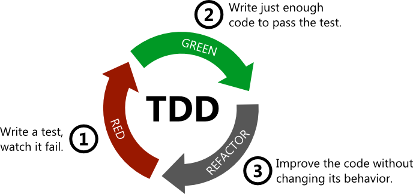

# Testes de unidade integrado com dotnet e C#
Repositório com experimentos baseados no curso de "Implementando sua stack de testes de unidade e integrados em um projeto .NET de Crowdfunding", ministrado por Eliézer Zarpelão na plataforma de Digital Innovation One

# Tipos mais comuns de teste

- Teste de unidade
- Teste de integração 
- Testes automatizados

## Testes de unidade / UnitTest

- **Unidade**: menor parte testável de um software

- **Orientação a objetos**: classe

  

## Teste de integração

Encontrar falhas de integração entre as unidades, e não mais em testar as funcionalidades da mesma

Integração entre unidades ou entre sistemas

## Testes Automatizados

"Simula" ações do usuário

**Aceitação:** caixa preta

**Regressão:** Garante integridade de versões passadas

**Processo de automatização é caro:** selecionar funcionalidades

# TDD (Test-Driven Development)

